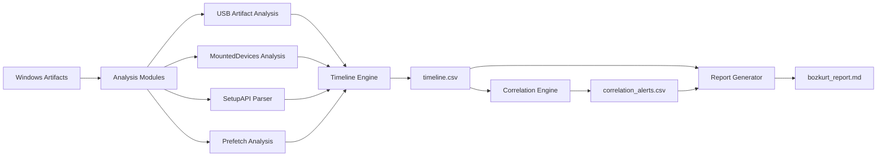

## Türkçe DFIR Framework

Bozkurt İzi, Windows sistemleri üzerinde artefakt analizi, timeline üretimi, olay korelasyonu ve otomatik analiz raporu oluşturmayı hedefleyen açık kaynaklı bir DFIR framework’üdür.

# Bozkurt İzi


## 🚧 Project Status

Bozkurt İzi aktif geliştirme aşamasındadır.

Framework şu anda temel artefakt analiz modülleri, timeline üretimi ve ilk korelasyon motorunu içermektedir. Mimari katmanlar geliştirilmekte olup proje araştırma ve geliştirme sürecindedir.

Yeni özellikler ve mimari iyileştirmeler roadmap doğrultusunda ilerlemektedir.
**Bozkurt İzi**, Windows sistemleri üzerinde dijital adli bilişim (DFIR) analizi yapmak için geliştirilen açık kaynaklı bir Türkçe analiz framework’üdür.

Framework; artefakt analizi, zaman çizelgesi üretimi, olay korelasyonu ve analiz raporu oluşturma süreçlerini otomatikleştirmeyi amaçlar.

---

## Özellikler

- USB artefakt analizi
- MountedDevices registry analizi
- SetupAPI cihaz geçmişi analizi
- Prefetch çalıştırma geçmişi analizi
- Timeline üretimi
- Korelasyon motoru
- Markdown analiz raporu üretimi

---

## Mimari Akış



Bozkurt İzi, Windows artefaktlarını modüler analiz katmanlarından geçirerek zaman çizelgesi, korelasyon çıktıları ve okunabilir analiz raporu üretmeyi hedefler.

---

## Proje Yapısı

```text
bozkurt-izi
│
├─ bozkurt.py
│
├─ engine
│   ├─ timeline_engine.py
│   ├─ correlation_engine.py
│   └─ case_manager.py
│
├─ modules
│   ├─ prefetch_analysis.py
│   ├─ usb_artifact_analysis.py
│   ├─ mounted_devices_analysis.py
│   └─ setupapi_parser.py
│
├─ core
│   └─ report_generator.py
│
├─ collectors
│   └─ collect_rdp_events.ps1
│
├─ output
│   └─ (analiz çıktıları)
│
├─ cases
│   └─ (case klasörleri)
│
└─ docs
```

---

## Kurulum

Projeyi klonlayın:

```bash
git clone https://github.com/redzeptech/bozkurt-izi.git
cd bozkurt-izi
```

Python 3.10+ önerilir.

---

## Kullanım

### Yeni analiz vakası oluştur

```bash
python bozkurt.py case
```

### Prefetch analizi

```bash
python bozkurt.py prefetch
```

### USB artefakt analizi

```bash
python bozkurt.py usb
```

### MountedDevices analizi

```bash
python bozkurt.py mounted
```

### SetupAPI cihaz geçmişi

```bash
python bozkurt.py setupapi
```

### Timeline oluşturma

```bash
python bozkurt.py timeline
```

### Korelasyon analizi

```bash
python bozkurt.py correlate
```

### Analiz raporu üretme

```bash
python bozkurt.py report
```

### Tüm pipeline'ı çalıştırma

```bash
python bozkurt.py full
```

---

## Üretilen Çıktılar

Analiz sonucunda `output` klasöründe aşağıdaki dosyalar oluşur:

```text
output/
├─ timeline.csv
├─ correlation_alerts.csv
├─ usb_artifacts.csv
├─ prefetch_timeline.csv
└─ bozkurt_report.md
```

---
## Proje Vizyonu

Bozkurt İzi'nin uzun vadeli hedefi, Windows artefaktlarını yalnızca analiz eden bir araç olmak değil; bu artefaktlar arasındaki ilişkileri ortaya çıkararak olayların bağlamını anlamaya yardımcı olan bir DFIR inceleme motoru oluşturmaktır.

Framework zaman içinde artefakt analizi → zaman çizelgesi → olay korelasyonu → davranış kümeleri → otomatik analiz raporları üreten bir investigation engine haline gelmeyi hedeflemektedir.

---
## Amaç

Bozkurt İzi'nin amacı:

- Türkçe DFIR araç ekosistemine katkı sağlamak
- Windows artefakt analizini kolaylaştırmak
- Açık kaynaklı DFIR araç geliştirme kültürünü desteklemek

---

## Yol Haritası

Planlanan geliştirmeler:

- HTML rapor üretimi
- JSON rapor çıktısı
- Gelişmiş korelasyon kuralları
- Ek Windows artefakt modülleri
- SIEM entegrasyonu

---

## Lisans

Bu proje MIT License altında lisanslanmıştır.

---

## Example Report

Example output coming soon.

## Örnek Çıktı

Bozkurt İzi analiz sonucunda aşağıdaki gibi bir rapor üretebilir:

[USB Activity Detected]

Device Install:
USB Storage device detected in SetupAPI logs.

MountedDevices Update:
New device mapping created in registry.

Prefetch Execution:
Program execution observed after device connection.

Possible removable media activity detected.
Bu çıktı artefaktlar arasındaki ilişkiyi anlamayı kolaylaştırmak için oluşturulur.
